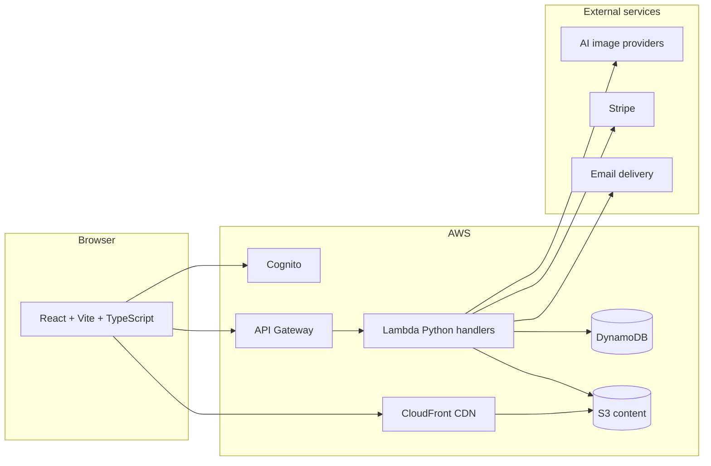

# PersonifyIt

## 1. What is PersonifyIt?

The website can be viewed here: https://personifyit.com.

**PersonifyIt** is a web application for **creating and viewing visual “design cards”** (single or double-sided). 

## 2. Why did I initially build it?

- **Experiment with prompt engineering and AI APIs** — I wanted to explore how I can use prompt engineering to build a real product application. I also wanted to explore AI APIs and see how I'm able to build a product with them. I decided to go with Image Generation APIs because I love seeing the images that are created with each prompt.

## 3. Technical highlights

| Theme | What I focused on |
| --- | --- |
| **AI & prompts** | Integrating **AI image generation** behind the design flows, with **server-side content moderation** responses when a provider blocks a request — so UX and safety are handled explicitly, not as an afterthought. |
| **Controlled access** | **Invite-based sign-up**: the client collects an invite code; the backend validates it (hashed comparison via env configuration) during confirmation, supporting a closed or phased rollout. |
| **Trust & safety** | **“Report an Issue”** flow: authenticated users submit structured reports (violation type, content type, description, optional links/attachments); the backend **delivers reports to operators** via email with a sensible **Reply-To** to the reporter. |
| **Private media & uploads** | User content goes to **S3** using **presigned POST** policies (scoped key, size, and content constraints), not long-lived bucket credentials in the browser. Private reads use **CloudFront** with **signed cookies** obtained after login so many images load without per-object API signing. |
| **Serverless backend shape** | **AWS Amplify Gen 2** + **Lambda (Python)**: thin HTTP handlers, shared validation, services for business logic, DAO-style persistence to **DynamoDB** — a structure that stays understandable as features grow. |
| **Frontend quality** | **TypeScript**, **TanStack Query** for server state, centralized **authorized fetch** (including refresh on `401`), and consistent **`@src`** imports for maintainability. |
| **Monetization of AI usage (where applicable)** | **Stripe Embedded Checkout** and webhooks for **AI credits**, mapping users to Stripe customers for repeat purchases — relevant where the product charges for API-backed usage. |

---

## 4. Architecture (high level)

**In plain terms**

- The **frontend** talks to **Cognito** for auth and to **API Gateway + Lambda** for REST operations.
- **Design metadata** lives in **DynamoDB**; **binary assets** live in **S3** and are read through **CloudFront** when cookies allow.
- **AI generation** and **payments/email** are integrated at the service layer so the same app can enforce **moderation**, **idempotent webhooks**, and **operable** reporting.

---

## 5. Some Features

These are the capabilities I call out when describing **what ships today**:

1. **Authentication with invite code** — Sign-up requires a valid **invite code** (validated server-side against a configured hash), so access can be restricted without building a full custom identity provider.
2. **Reporting content moderation issues** — Users can file **structured reports** (“Report an Issue”) with violation/content categorization and optional evidence; operators receive actionable email threads.
3. **Creating and editing a single- or double-sided design card** — Authoring flow supports **one or two sides**, preview, and integration with **AI-assisted imagery** where the product uses it.
4. **Viewing a design** — Read-only **view** experience aligned with create/edit preview patterns (including flip between sides for double-sided designs).

*Last updated: March 2026.*
