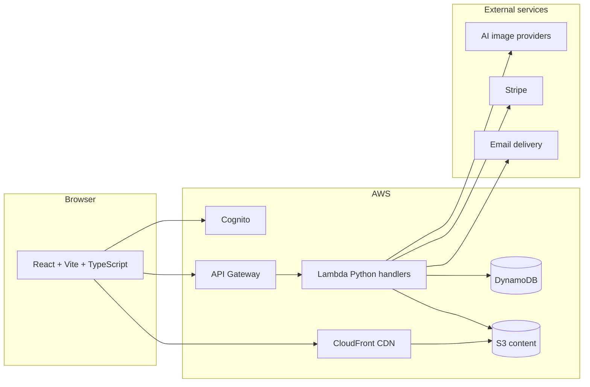

# PersonifyIt

## 1. What is PersonifyIt?

The website can be viewed here: https://personifyit.com.

**PersonifyIt** is a web application for **creating and viewing visual “design cards”** (single or double-sided). 

## 2. Why did I initially build it?

- **Experiment with prompt engineering and AI APIs** — I wanted to explore how I can use prompt engineering to build a real product application. I also wanted to explore AI APIs and see how I'm able to build a product with them. I decided to go with Image Generation APIs because I love seeing the images that are created with each prompt.

## 3. Technical highlights

| Theme | What I focused on |
| --- | --- |
| **AI & prompts** | Integrating **AI image generation** behind the design flows, with **server-side content moderation** responses when a provider blocks a request — so UX and safety are handled explicitly, not as an afterthought. |
| **Controlled access** | **Invite-based sign-up**: the client collects an invite code; the backend validates it (hashed comparison via env configuration) during confirmation, supporting a closed or phased rollout. |
| **Trust & safety** | **“Report an Issue”** flow: authenticated users submit structured reports (violation type, content type, description, optional links/attachments); the backend **delivers reports to operators** via email with a sensible **Reply-To** to the reporter. |
| **Private media & uploads** | User content goes to **S3** using **presigned POST** policies (scoped key, size, and content constraints), not long-lived bucket credentials in the browser. Private reads use **CloudFront** with **signed cookies** obtained after login so many images load without per-object API signing. |
| **Serverless backend shape** | **AWS Amplify Gen 2** + **Lambda (Python)**: thin HTTP handlers, shared validation, services for business logic, DAO-style persistence to **DynamoDB** — a structure that stays understandable as features grow. |
| **Frontend quality** | **TypeScript**, **TanStack Query** for server state, centralized **authorized fetch** (including refresh on `401`), and consistent **`@src`** imports for maintainability. |
| **Monetization of AI usage (where applicable)** | **Stripe Embedded Checkout** and webhooks for **AI credits**, mapping users to Stripe customers for repeat purchases — relevant where the product charges for API-backed usage. |

---

## 4. Architecture (high level)

**In plain terms**

- The **frontend** talks to **Cognito** for auth and to **API Gateway + Lambda** for REST operations.
- **Design metadata** lives in **DynamoDB**; **binary assets** live in **S3** and are read through **CloudFront** when cookies allow.
- **AI generation** and **payments/email** are integrated at the service layer so the same app can enforce **moderation**, **idempotent webhooks**, and **operable** reporting.

---

## 5. Some Features

These are the capabilities I call out when describing **what ships today**:

1. **Authentication, access, and onboarding**
- **Invite-code sign-up** — New accounts submit an **invite code** at confirmation time; the backend checks it against a **configured hash** so you can run a closed or phased beta.
- **Cognito-backed sessions** — Sign-in, protected dashboard routes, and token refresh handled through **AWS Amplify Auth** with shared client utilities for API calls.
- **Marketing / legal shell** — **Landing page**, **Terms**, **Privacy**, and **Help** routes for a complete public surface around the app.
2. **Designs**
- **Single- or double-sided design cards** — Create **one or two sides**, with a **flip preview** consistent across create, edit, and view.
- **Multiple image sources** — **Template-backed** sides, **manual file upload** (presigned POST to S3), and **AI-generated** imagery wired through backend providers (with moderation-aware error handling).
- **Design library** — Paginated **list of your designs** with **search**, **visibility** (public/private), and **dimension** filters.
- **Design detail (read-only)** — Dedicated **view** page with the same visual language as the editor; supports opening **another user’s public design** when the route includes owner context.
- **Public vs private** — Toggle **visibility** on a design so it can appear in discovery surfaces when public.
- **Optional QR on text cards** — For text-oriented layouts, **QR codes** can be enabled so cards combine copy + scannable content (portrait/landscape preview layouts).
- **Export** — **Download** designs as **PNG** or **PDF** (including double-sided PDF layout where applicable).
3. **Discovery and profiles**
- **Home feed** — Browse **public designs** from the community with **filters** and **cursor-based pagination**, with navigation that preserves “return to page” context when drilling into a design.
- **User profiles** — **Profile pages by user id** to browse that person’s public designs (with pagination).
- **Public profile preview** — Signed-in users can **preview how their own public profile** appears to others.
4. **Collections**
- **Collections list and detail** — Organize designs into **collections**; open a collection to see its members (with pagination and deep links).
- **Public / private collections** — Control whether a collection is exposed like public designs.
- **Collection cover imagery** — **Cover image** support with the same **presigned upload** pattern used for design assets.
5. **AI usage and billing**
- **AI credits** — Purchase **credit packages** through **Stripe Embedded Checkout** (in-app, no full redirect to Stripe’s hosted page).
- **Payment history** — **Dashboard page** for past **AI-credit** purchases tied to the account.
- **Saved payment methods** — Returning checkout uses a **stored Stripe customer** mapping when valid (with backend fallback if Stripe data was removed).

*Last updated: March 2026.*
